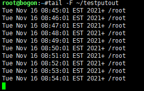

# 概念

Linux crontab是用来定期执行程序的命令。

当安装完成操作系统之后，默认便会启动此任务调度命令。

crond 命令每分锺会定期检查是否有要执行的工作，如果有要执行的工作便会自动执行该工作。

**注意：**新创建的 cron 任务，不会马上执行，至少要过 2 分钟后才可以，当然你可以重启 cron 来马上执行。

# 使用

## 环境

* CentOS Linux release 7.9.2009 (Core)

## 步骤

1. 新建文件

```shell
vim ~/testcronfile
```

2.在testcronfile输入内容：

> ```
> * * * * * echo `date`+ `pwd` >> ~/testputout  
> ```

#每分钟执行一次 echo `date`+ `pwd` >> ~/testputout 命令
#将输出的内容重定向并追加到~/testputout

3.执行命令

```shell
crontab ~/testcronfile
```

4.查看输出：

> tail -F ~/testputout 

结果如图所示：



至此，实现了一分钟执行一次命令。

下面讲解语法。

# 语法

```shell
crontab [ -u user ] file
# 或
crontab [ -u user ] { -l | -r | -e }
```

**参数说明**

	 *  -u user 是指设定指定 user 的时程表，这个前提是你必须要有其权限(比如说是 root)才能够指定他人的时程表。如果不使用 -u user 的话，就是表示设定自己的时程表。
	 *  -e : 执行文字编辑器来设定时程表。
	 *  -r : 删除目前的时程表
	 *  -l : 列出目前的时程表

**时间的格式如下**

```ini
f1 f2 f3 f4 f5 program
```

- 其中 f1 是表示分钟，f2 表示小时，f3 表示一个月份中的第几日，f4 表示月份，f5 表示一个星期中的第几天。program 表示要执行的程序。
- 当 f1 为 * 时表示每分钟都要执行 program，f2 为 * 时表示每小时都要执行程序，其余类推
- 当 f1 为 a-b 时表示从第 a 分钟到第 b 分钟这段时间内要执行，f2 为 a-b 时表示从第 a 到第 b 小时都要执行，其余类推
- 当 f1 为 */n 时表示每 n 分钟个时间间隔执行一次，f2 为 */n 表示每 n 小时个时间间隔执行一次，其余类推
- 当 f1 为 a, b, c,... 时表示第 a, b, c,... 分钟要执行，f2 为 a, b, c,... 时表示第 a, b, c...个小时要执行，其余类推


# 实例

```
* * * * * /bin/ls     每一分钟执行一次 /bin/ls

0 6-12/3 * 12 * /usr/bin/backup    在 12 月内, 每天的早上 6 点到 12 点，每隔 3 个小时 0 分钟执行一次 /usr/bin/backup

0 17 * * 1-5 mail -s "hi" alex@domain.name < /tmp/maildata   周一到周五每天下午 5:00 寄一封信给 alex@domain.name

20 0-23/2 * * * echo "haha"     意思是每月每天的午夜 0 点 20 分, 2 点 20 分, 4 点 20 分....执行 echo "haha"

0 */2 * * * /sbin/service httpd restart  意思是每两个小时重启一次apache 

50 7 * * * /sbin/service sshd start  意思是每天7：50开启ssh服务 

50 22 * * * /sbin/service sshd stop  意思是每天22：50关闭ssh服务 

0 0 1,15 * * fsck /home  每月1号和15号检查/home 磁盘 

1 * * * * /home/bruce/backup  每小时的第一分执行 /home/bruce/backup这个文件 

00 03 * * 1-5 find /home "*.xxx" -mtime +4 -exec rm {} \;  每周一至周五3点钟，在目录/home中，查找文件名为*.xxx的文件，并删除4天前的文件。

30 6 */10 * * ls  意思是每月的1、11、21、31日是的6：30执行一次ls命令
```

# 注意事项

## 一

如果我们使用 crontab 来定时执行脚本，无法执行，但是如果直接通过命令（如：./test.sh)又可以正常执行，这主要是因为无法读取环境变量的原因。

**解决方法：**

- 1、所有命令需要写成绝对路径形式，如: **/usr/local/bin/docker**。
- 2、在 shell 脚本开头使用以下代码：

```shell
#!/bin/sh

. /etc/profile
. ~/.bash_profile
```

* 3、在 **/etc/crontab** 中添加环境变量，在可执行命令之前添加命令 **. /etc/profile;/bin/sh**，使得环境变量生效，例如：

    ```ini
    20 03 * * * . /etc/profile;/bin/sh /var/www/runoob/test.sh
    ```

## 二

新创建的cron job，不会马上执行，至少要过2分钟才执行。如果重启cron则马上执行。

当crontab突然失效时，可以尝试/etc/init.d/crond restart解决问题。或者查看日志看某个job有没有执行/报错tail -f /var/log/cron。

千万别乱运行crontab -r。它从Crontab目录（/var/spool/cron）中删除用户的Crontab文件。删除了该用户的所有crontab都没了。

在crontab中%是有特殊含义的，表示换行的意思。如果要用的话必须进行转义\%，如经常用的date ‘+%Y%m%d’在crontab里是不会执行的，应该换成date ‘+\%Y\%m\%d’。