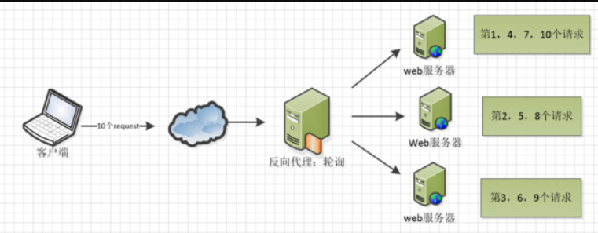
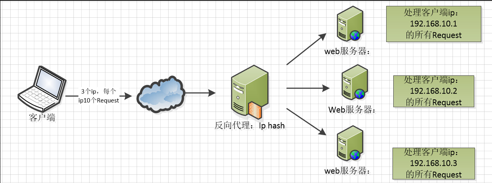
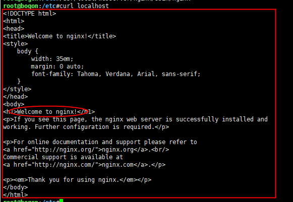

# Nginx

## 1、Nginx概述

高性能的 Web和 反向代理 服务器，也是一个 IMAP/POP3/SMTP 代理服务器

在高连接并发的情况下，Nginx是Apache服务器不错的替代品。

相关地址：[源码](https://trac.nginx.org/nginx/browser) [官网](http://www.nginx.org/) 

#### 1.1 Http代理，反向代理

Nginx在做反向代理时，提供性能稳定，并且能够提供配置灵活的转发功能。Nginx可以根据不同的正则匹配，采取不同的转发策略，比如图片文件结尾的走文件服务器，动态页面走web服务器，只要你正则写的没问题，又有相对应的服务器解决方案，你就可以随心所欲的玩。并且Nginx对返回结果进行错误页跳转，异常判断等。如果被分发的服务器存在异常，他可以将请求重新转发给另外一台服务器，然后自动去除异常服务器。

#### 1.2 负载均衡

Nginx提供的负载均衡策略有2种：内置策略和扩展策略。内置策略为轮询，加权轮询，Ip hash。

##### 1.2.1 轮询



##### 1.2.2 加权轮询


##### 1.2.3 Ip hash



扩展策略，就天马行空了，只有你想不到的没有他做不到的啦，可以实现所有的负载均衡算法。

## 2、Nginx安装

### 2.1 环境

* CentOS Linux release 7.9.2009 (Core)

### 2.2 安装编译工具及库文件

```shell
yum -y install make zlib zlib-devel gcc-c++ libtool  openssl openssl-devel
```

### 2.3 安装 PCRE

让Nginx支持Rewrite

```shell
curl -o pcre-8.45.tar.gz  https://jaist.dl.sourceforge.net/project/pcre/pcre/8.45/pcre-8.45.tar.gz  #下载
tar zxvf pcre-8.45.tar.gz  #解压
cd pcre-8.45
./configure
make && make install  #安装
pcre-config --version  #查看pcre版本号
```


### 2.4 安装Nginx

```shell
curl -o nginx-1.20.1.tar.gz  https://nginx.org/download/nginx-1.20.1.tar.gz  #下载
tar zxvf nginx-1.20.1.tar.gz  #解压
cd nginx-1.20.1
./configure --prefix=/usr/local/webserver/nginx --with-http_stub_status_module --with-http_ssl_module --with-pcre=/root/download/pcre-8.45
make && make install  #安装，查看输出可知nginx被安装到了/usr/local/webserver/nginx
/usr/local/webserver/nginx/sbin/nginx -v  #查看nginx版本号
```

## 3、配置

1. 创建一个用户nginx，用来运行Nginx

```shell
adduser -M nginx  #创建用户nginx
```

2. 配置nginx.conf

```shell
vim /usr/local/webserver/nginx/conf/nginx.conf
```

​		配置内容为

> ```ini
> user nginx nginx;
> worker_processes 2; #设置值和CPU核心数一致
> error_log /usr/local/webserver/nginx/logs/nginx_error.log crit; #日志位置和日志级别
> pid /usr/local/webserver/nginx/nginx.pid;
> #Specifies the value for maximum file descriptors that can be opened by this process.
> worker_rlimit_nofile 65535;
> events
> {
>   use epoll;
>   worker_connections 65535;
> }
> http
> {
>       include mime.types;
>       default_type application/octet-stream;
>       log_format main  '$remote_addr - $remote_user [$time_local] "$request" '
>                    '$status $body_bytes_sent "$http_referer" '
>                    '"$http_user_agent" $http_x_forwarded_for';
>   
>     #charset gb2312;
>      
>       server_names_hash_bucket_size 128;
>       client_header_buffer_size 32k;
>       large_client_header_buffers 4 32k;
>       client_max_body_size 8m;
>      
>       sendfile on;
>       tcp_nopush on;
>       keepalive_timeout 60;
>       tcp_nodelay on;
>       fastcgi_connect_timeout 300;
>       fastcgi_send_timeout 300;
>       fastcgi_read_timeout 300;
>       fastcgi_buffer_size 64k;
>       fastcgi_buffers 4 64k;
>       fastcgi_busy_buffers_size 128k;
>       fastcgi_temp_file_write_size 128k;
>       gzip on; 
>       gzip_min_length 1k;
>       gzip_buffers 4 16k;
>       gzip_http_version 1.0;
>       gzip_comp_level 2;
>       gzip_types text/plain application/x-javascript text/css application/xml;
>       gzip_vary on;
>  
>       #limit_zone crawler $binary_remote_addr 10m;
>      #下面是server虚拟主机的配置
>      server
>       {
>             listen 80;#监听端口
>             server_name localhost;#域名
>             index index.html index.htm index.php;
>             root /usr/local/webserver/nginx/html;#站点目录 
>             access_log off;
>        }
>    
>    }
>    ```


4. 检查配置文件nginx.conf的正确性命令：

```shell
/usr/local/webserver/nginx/sbin/nginx -t
#nginx: the configuration file /usr/local/webserver/nginx/conf/nginx.conf syntax is ok
#nginx: configuration file /usr/local/webserver/nginx/conf/nginx.conf test is successful
```


## 4、启动

```shell
/usr/local/webserver/nginx/sbin/nginx  #启动！
curl localhost  #访问，测试。
```



Welcome to nginx! 

bingo！！

## 5、配置文件

下面是一个示例配置文件作为理解：

> ```ini
> ########### 每个指令必须有分号结束。#################
> #user administrator administrators;  #配置用户或者组，默认为nobody nobody。
> #worker_processes 2;  #允许生成的进程数，默认为1
> #pid /nginx/pid/nginx.pid;   #指定nginx进程运行文件存放地址
> error_log log/error.log debug;  #制定日志路径，级别。这个设置可以放入全局块，http块，server块，级别以此为：debug|info|notice|warn|error|crit|alert|emerg
> events {
>     accept_mutex on;   #设置网路连接序列化，防止惊群现象发生，默认为on
>     multi_accept on;  #设置一个进程是否同时接受多个网络连接，默认为off
>     #use epoll;      #事件驱动模型，select|poll|kqueue|epoll|resig|/dev/poll|eventport
>     worker_connections  1024;    #最大连接数，默认为512
> }
> http {
>     include       mime.types;   #文件扩展名与文件类型映射表
>     default_type  application/octet-stream; #默认文件类型，默认为text/plain
>     #access_log off; #取消服务日志    
>     log_format myFormat '$remote_addr–$remote_user [$time_local] $request $status $body_bytes_sent $http_referer $http_user_agent $http_x_forwarded_for'; #自定义格式
>     access_log log/access.log myFormat;  #combined为日志格式的默认值
>     sendfile on;   #允许sendfile方式传输文件，默认为off，可以在http块，server块，location块。
>     sendfile_max_chunk 100k;  #每个进程每次调用传输数量不能大于设定的值，默认为0，即不设上限。
>     keepalive_timeout 65;  #连接超时时间，默认为75s，可以在http，server，location块。
> 
>     upstream mysvr {   
>       server 127.0.0.1:7878;
>       server 192.168.10.121:3333 backup;  #热备
>     }
>     error_page 404 https://www.baidu.com; #错误页
>     server {
>         keepalive_requests 120; #单连接请求上限次数。
>         listen       4545;   #监听端口
>         server_name  127.0.0.1;   #监听地址       
>         location  ~*^.+$ {       #请求的url过滤，正则匹配，~为区分大小写，~*为不区分大小写。
>            #root path;  #根目录
>            #index vv.txt;  #设置默认页
>            proxy_pass  http://mysvr;  #请求转向mysvr 定义的服务器列表
>            deny 127.0.0.1;  #拒绝的ip
>            allow 172.18.5.54; #允许的ip           
>         } 
>     }
> }
> ```

几个常见配置项

- $remote_addr 与 $http_x_forwarded_for 用以记录客户端的ip地址；
- $remote_user ：用来记录客户端用户名称；
- $time_local ： 用来记录访问时间与时区；
- $request ： 用来记录请求的url与http协议；
- $status ： 用来记录请求状态；成功是200；
- $body_bytes_s ent ：记录发送给客户端文件主体内容大小；
- $http_referer ：用来记录从那个页面链接访问过来的；
- $http_user_agent ：记录客户端浏览器的相关信息；

## 6、几个常用命令：

```shell
/usr/local/webserver/nginx/sbin/nginx -s reload            # 重新载入配置文件
/usr/local/webserver/nginx/sbin/nginx -s reopen            # 重启 Nginx
/usr/local/webserver/nginx/sbin/nginx -s stop              # 停止 Nginx
```


## 7、日志管理

日志，是容器中相当重要的一环。

通过日志，你可以得到用户地域来源、跳转来源、使用终端、某个URL访问量等相关信息；通过错误日志，你可以得到系统某个服务或server的性能瓶颈等。因此，将日志好好利用，你可以得到很多有价值的信息。

日志文件位置：

### 7.1 开启日志

在配置文件/usr/local/webserver/nginx/conf/nginx.conf中，我们已经定义了一个名为main的格式，而main的具体定义就是

```ini
  log_format main  '$remote_addr - $remote_user [$time_local] "$request" '
               '$status $body_bytes_sent "$http_referer" '
               '"$http_user_agent" $http_x_forwarded_for';
```

编辑配置文件nginx.conf，我们将 _#access_log off_ 注释内容释放开，改为如下配置

> server
>   {
>     listen 80;#监听端口
>     server_name localhost;#域名
>     index index.html index.htm index.php;
>     root /usr/local/webserver/nginx/html;#站点目录
>     access_log logs/access.log main;	**#开启日志，并且日志文件输出到/usr/local/webserver/nginx/logs/access.log**
>   }

重新加载配置文件，nginx -s reload，此时nginx会创建空白文件/usr/local/webserver/nginx/logs/access.log。

然后访问localhost:80，日志文件会以“main”格式输出到access.log，查看日志可以用 tail -F access.log

日志内容如下所示

> 192.168.1.242 - - [15/Nov/2021:09:49:42 -0500] "GET / HTTP/1.1" 304 0 "-" "Mozilla/5.0 (Windows NT 10.0; Win64; x64) AppleWebKit/537.36 (KHTML, like Gecko) Chrome/95.0.4638.69 Safari/537.36" -
> 192.168.1.242 - - [15/Nov/2021:09:49:43 -0500] "GET / HTTP/1.1" 304 0 "-" "Mozilla/5.0 (Windows NT 10.0; Win64; x64) AppleWebKit/537.36 (KHTML, like Gecko) Chrome/95.0.4638.69 Safari/537.36" -
> 192.168.1.242 - - [15/Nov/2021:09:49:43 -0500] "GET / HTTP/1.1" 304 0 "-" "Mozilla/5.0 (Windows NT 10.0; Win64; x64) AppleWebKit/537.36 (KHTML, like Gecko) Chrome/95.0.4638.69 Safari/537.36" -
> 192.168.1.242 - - [15/Nov/2021:09:49:43 -0500] "GET / HTTP/1.1" 304 0 "-" "Mozilla/5.0 (Windows NT 10.0; Win64; x64) AppleWebKit/537.36 (KHTML, like Gecko) Chrome/95.0.4638.69 Safari/537.36" -
> 192.168.1.242 - - [15/Nov/2021:09:49:44 -0500] "GET / HTTP/1.1" 304 0 "-" "Mozilla/5.0 (Windows NT 10.0; Win64; x64) AppleWebKit/537.36 (KHTML, like Gecko) Chrome/95.0.4638.69 Safari/537.36" -
> 192.168.1.242 - - [15/Nov/2021:09:49:44 -0500] "GET / HTTP/1.1" 304 0 "-" "Mozilla/5.0 (Windows NT 10.0; Win64; x64) AppleWebKit/537.36 (KHTML, like Gecko) Chrome/95.0.4638.69 Safari/537.36" -

| 参数明细列表：        |                                                      |
| --------------------- | ---------------------------------------------------- |
| $remote_addr          | 客户端的ip地址(代理服务器，显示代理服务ip)           |
| $remote_user          | 用于记录远程客户端的用户名称（一般为“-”）            |
| $time_local           | 用于记录访问时间和时区                               |
| $request              | 用于记录请求的url以及请求方法                        |
| $status               | 响应状态码，例如：200成功、404页面找不到等。         |
| $body_bytes_sent      | 给客户端发送的文件主体内容字节数                     |
| $http_user_agent      | 用户所使用的代理（一般为浏览器）                     |
| $http_x_forwarded_for | 可以记录客户端IP，通过代理服务器来记录客户端的ip地址 |
| $http_referer         | 可以记录用户是从哪个链接访问过来的                   |

### 7.2 日志分隔

nginx的日志文件没有rotate功能。编写每天生成一个日志，我们可以写一个nginx日志切割脚本来自动切割日志文件。

第一步就是重命名日志文件，不用担心重命名后nginx找不到日志文件而丢失日志。在你未重新打开原名字的日志文件前，nginx还是会向你重命名的文件写日志，Linux是靠文件描述符而不是文件名定位文件。

第二步向nginx主进程发送USR1信号。nginx主进程接到信号后会从配置文件中读取日志文件名称，重新打开日志文件(以配置文件中的日志名称命名)，并以工作进程的用户作为日志文件的所有者。重新打开日志文件后，nginx主进程会关闭重名的日志文件并通知工作进程使用新打开的日志文件。工作进程立刻打开新的日志文件并关闭重名名的日志文件。然后你就可以处理旧的日志文件了。[或者重启nginx服务]。

**nginx日志按每分钟自动切割脚本如下：**

新建shell脚本：vim  /usr/local/webserver/nginx/nginx_log.sh

```shell
#!/bin/bash
#设置日志文件存放目录
LOG_HOME="/usr/local/webserver/nginx/logs/"

#备分文件名称
LOG_PATH_BAK="$(date -d yesterday +%Y%m%d%H%M)".access.log

#重命名日志文件
mv ${LOG_HOME}/access.log ${LOG_HOME}/${LOG_PATH_BAK}.log

#向nginx主进程发信号重新打开日志 
kill -USR1 `cat /usr/local/webserver/nginx/nginx.pid`
```

**创建crontab设置作业**

\#设置日志文件存放目录crontab -e

*/1 * * * * sh /usr/local/webserver/nginx/nginx_log.sh
